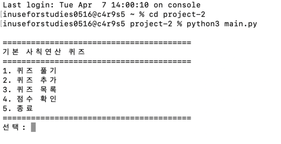
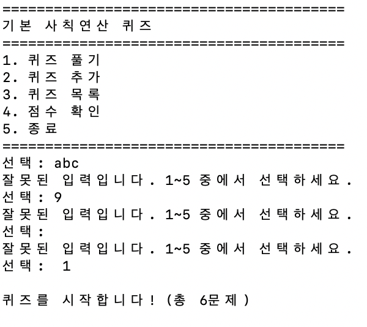
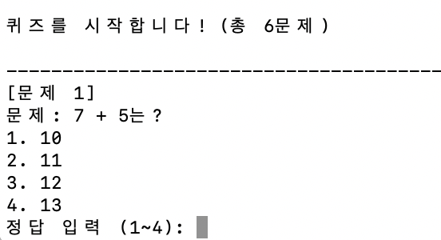
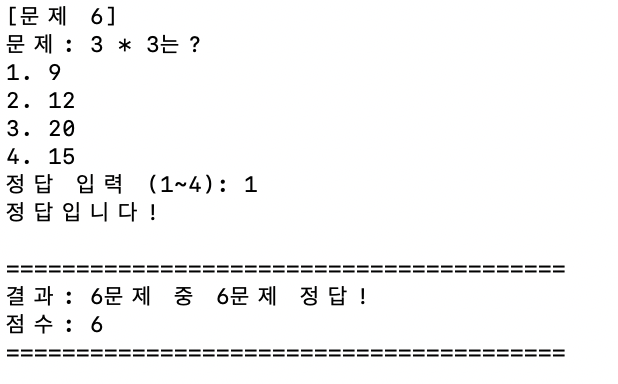
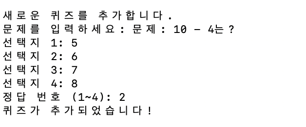
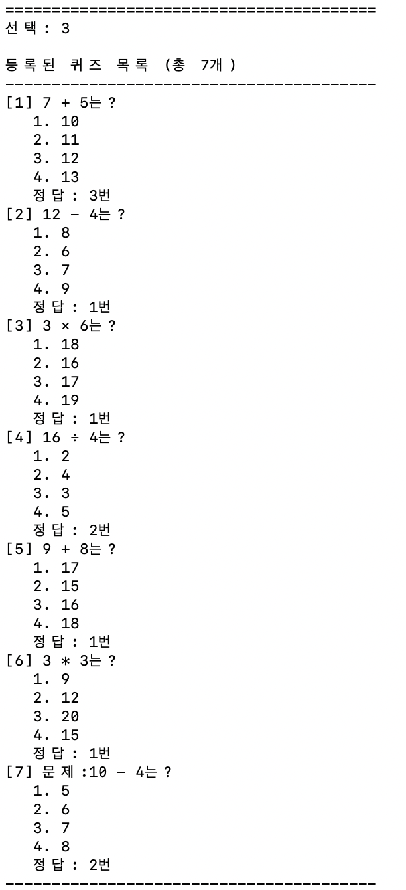
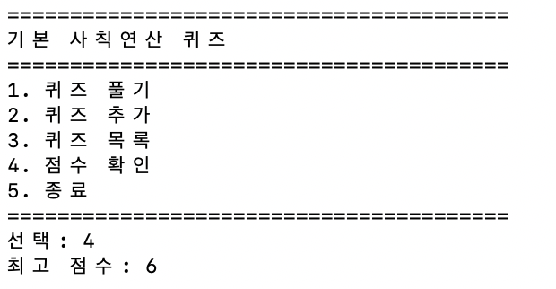
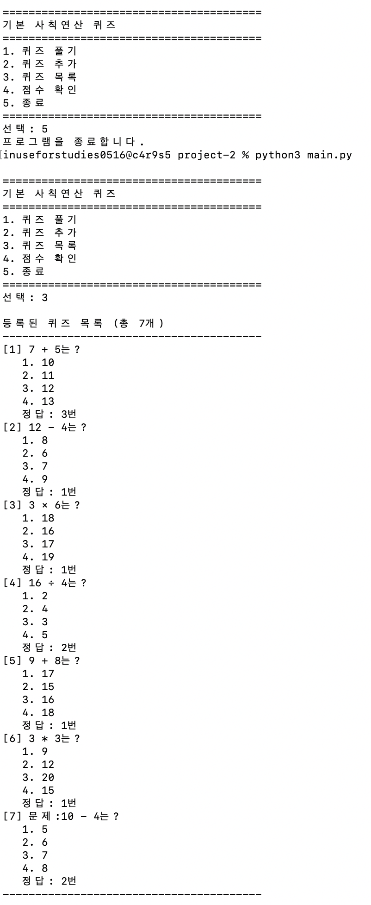
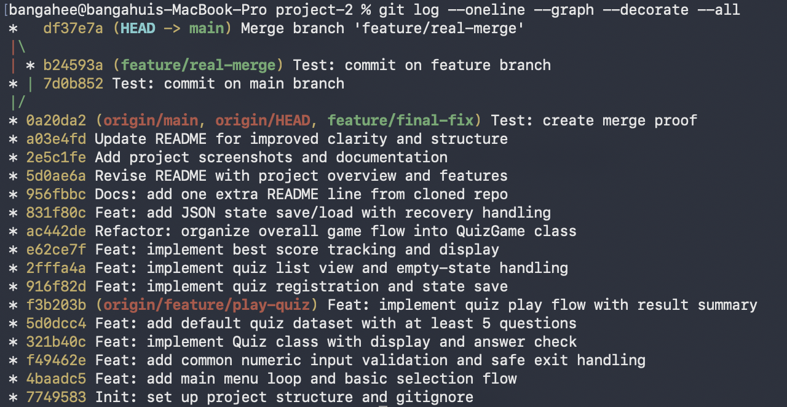

# 기본 사칙연산 퀴즈

> Python 콘솔 기반 퀴즈 게임

- **언어**: Python 3
- **저장 방식**: JSON
- **실행 환경**: 터미널 / 명령 프롬프트

---

## 프로젝트 개요

Python을 활용하여 만든 콘솔 기반 퀴즈 게임입니다.  
사용자는 퀴즈를 풀고, 새로운 퀴즈를 추가하며, 저장된 퀴즈 목록과 최고 점수를 확인할 수 있습니다.  
또한 JSON 파일(`state.json`)을 활용하여 프로그램 종료 후에도 퀴즈 데이터와 최고 점수가 유지되도록 구현했습니다.  
Git을 사용하여 기능 단위로 커밋하고, 브랜치를 나누어 개발 및 병합 과정을 기록했습니다.

---

## 퀴즈 주제 선정 이유

기본 사칙연산을 주제로 선택했습니다.  
누구나 쉽게 이해할 수 있는 내용이기 때문에, 문제 자체의 난이도보다 프로그램의 핵심 기능인 입력 처리, 예외 처리, 데이터 저장, 메뉴 구성, 파일 복구 로직 등을 구현하는 데 집중할 수 있다고 판단했습니다.

---

## 실행 방법

```bash
python3 main.py
````

프로그램 실행 후 메뉴에서 원하는 기능의 번호를 입력하여 사용할 수 있습니다.

---

## 기능 목록

### 1. 퀴즈 풀기

* 저장된 퀴즈를 순서대로 출제
* 사용자 입력을 받아 정답/오답 판별
* 전체 결과와 최종 점수 출력
* 최고 점수 자동 갱신

### 2. 퀴즈 추가

* 문제, 선택지 4개, 정답 번호 입력
* 빈 입력 및 범위 오류 검증
* 새 퀴즈를 목록에 추가하고 즉시 저장

### 3. 퀴즈 목록 확인

* 저장된 전체 퀴즈 출력
* 각 퀴즈의 선택지와 정답 번호 확인
* 전체 퀴즈 수 확인 가능

### 4. 점수 확인

* 최고 점수 출력
* 아직 플레이 기록이 없는 경우 안내 메시지 출력

### 5. 데이터 저장 및 유지

* `state.json` 파일에 퀴즈 목록과 최고 점수 저장
* 프로그램을 종료한 뒤 다시 실행해도 데이터 유지

### 6. 예외 처리

* 잘못된 숫자 입력 처리
* 빈 입력 처리
* 범위 초과 입력 처리
* `Ctrl+C`, `EOF` 입력 시 안전하게 종료 또는 메뉴 복귀
* `state.json` 파일이 없거나 손상된 경우 기본 퀴즈로 복구

---

## 파일 구조

```text
project/
├── main.py                  # 퀴즈 게임 메인 코드
├── state.json               # 퀴즈 데이터 및 최고 점수 저장 파일
├── README.md
└── docs/
    └── screenshots/         # 실행 화면 및 Git 기록 스크린샷
```

---

## 데이터 파일 설명 (`state.json`)

퀴즈 데이터와 최고 점수를 JSON 형식으로 저장합니다.

```json
{
  "quizzes": [
    {
      "question": "문제",
      "choices": ["선택지1", "선택지2", "선택지3", "선택지4"],
      "answer": 1
    }
  ],
  "best_score": 3
}
```

### 저장 구조 설명

* `quizzes`: 전체 퀴즈 목록
* `question`: 문제 내용
* `choices`: 4개의 선택지
* `answer`: 정답 번호
* `best_score`: 최고 점수

### 특징

* UTF-8 인코딩 사용
* 파일이 없을 경우 기본 퀴즈 자동 로드
* 파일이 손상되었거나 형식이 잘못된 경우 기본 퀴즈로 복구 후 다시 저장

---

## 코드 구조 및 설계

### `Quiz` 클래스

`Quiz` 클래스는 개별 퀴즈 1개를 표현하기 위한 클래스입니다.

주요 역할:

* 문제, 선택지, 정답 저장
* 문제 출력
* 사용자 정답 확인
* JSON 저장을 위한 딕셔너리 변환

퀴즈 한 개의 데이터와 동작을 하나의 클래스로 묶어서 관리하도록 구성했습니다.

### `QuizGame` 클래스

`QuizGame` 클래스는 게임 전체 흐름을 관리하는 클래스입니다.

주요 역할:

* 메뉴 출력
* 사용자 입력 처리
* 퀴즈 풀이 진행
* 퀴즈 추가
* 퀴즈 목록 출력
* 최고 점수 확인
* 파일 저장 및 불러오기
* 예외 처리 및 복구

즉, `Quiz`가 개별 문제를 담당하고 `QuizGame`이 전체 게임 진행을 담당하도록 책임을 나누었습니다.

---

## 입력 처리 및 예외 처리 방식

사용자 입력은 별도의 메서드로 분리하여 처리했습니다.

### `get_number_input()`

* 숫자 입력 전용
* 빈 입력, 문자 입력, 범위 초과 입력을 검사
* 잘못된 경우 다시 입력 유도
* `Ctrl+C`, `EOF` 발생 시 안전 종료 또는 상위 메뉴 복귀

### `get_text_input()`

* 문자열 입력 전용
* 빈 문자열 입력 방지
* 입력 중단 시 메뉴로 복귀

이처럼 입력 처리를 분리한 이유는 중복 코드를 줄이고, 동일한 검증 규칙을 여러 기능에서 재사용하기 위해서입니다.

---

## 상태 저장 및 복구 방식

프로그램은 `state.json` 파일을 사용하여 데이터를 저장합니다.

### 저장 시

* 현재 퀴즈 목록과 최고 점수를 JSON 형식으로 저장

### 불러오기 시

* 파일이 정상적이면 기존 데이터를 불러옴
* 파일이 없으면 기본 퀴즈를 생성
* 파일이 손상되었거나 구조가 잘못된 경우 기본 퀴즈로 복구
* 복구 후에는 다시 저장하여 이후 실행 시 정상 파일을 사용 가능하게 함

이 과정을 통해 프로그램이 파일 문제로 비정상 종료되지 않도록 설계했습니다.

---

## 테스트 및 확인한 항목

다음 항목들을 직접 실행하여 확인했습니다.

* 프로그램 실행 시 메뉴가 정상적으로 출력되는지
* 퀴즈 풀이 기능이 정상 동작하는지
* 정답과 오답 판별이 정확한지
* 잘못된 입력 시 재입력이 유도되는지
* 퀴즈 추가 후 목록에 반영되는지
* 최고 점수가 정상적으로 갱신되는지
* 프로그램 재실행 후 데이터가 유지되는지
* `state.json`이 없을 때 기본 퀴즈가 복구되는지
* `state.json`이 손상되었을 때 자동 복구되는지
* Git 브랜치 생성/병합 기록이 남아 있는지
* clone 및 pull 실습 결과가 반영되었는지

---

## 실행 화면 스크린샷

### 메인 메뉴



### 잘못된 입력 처리



### 퀴즈 풀이



### 퀴즈 결과



### 퀴즈 추가



### 퀴즈 목록



### 점수 확인



### 데이터 유지 확인



### Git 기록



---

## Git 작업 방식

기능 단위로 커밋을 수행하고, 브랜치를 생성하여 기능 개발 후 병합했습니다.

### 브랜치 구조

| 브랜치명                | 설명            |
| ------------------- | ------------- |
| `main`              | 최종 제출 브랜치     |
| `feature/quiz-play` | 퀴즈 풀기 기능      |
| `feature/add-quiz`  | 퀴즈 추가 기능      |
| `feature/file-io`   | 파일 저장/불러오기 기능 |
| `feature/exception` | 예외 처리 기능      |

### 사용한 Git 명령어

| 명령어            | 설명            |
| -------------- | ------------- |
| `git init`     | 로컬 저장소 생성     |
| `git add`      | 변경 파일 스테이징    |
| `git commit`   | 변경 사항 저장      |
| `git push`     | 원격 저장소 업로드    |
| `git pull`     | 원격 변경 사항 가져오기 |
| `git checkout` | 브랜치 이동 및 생성   |
| `git merge`    | 브랜치 병합        |
| `git clone`    | 저장소 복제        |

---

## 마무리

이번 프로젝트를 통해 Python 클래스 분리, 입력 검증, 예외 처리, JSON 파일 저장, 데이터 복구, Git 브랜치 관리와 같은 기본적인 개발 흐름을 직접 구현해 볼 수 있었습니다.
단순한 콘솔 프로그램이지만, 실제로는 입력 안정성, 파일 무결성, 기능 분리, 유지보수성을 함께 고려해야 한다는 점을 배울 수 있었습니다.
